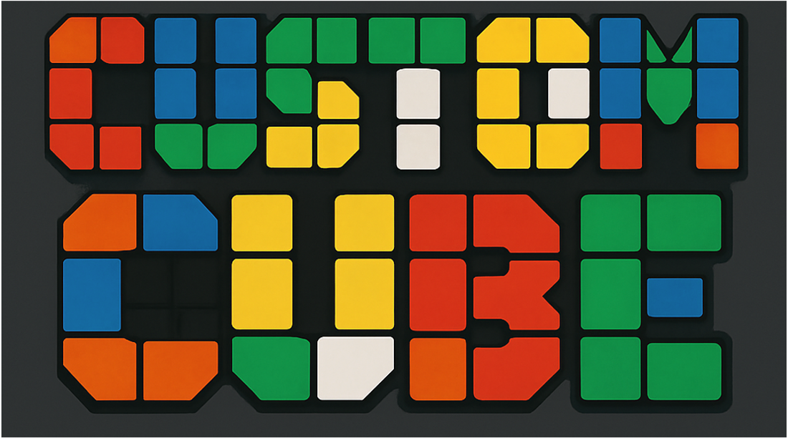

# 🧊 Custom Cube

**Custom Cube** is a Rubik’s Cube-style application where you can personalize each face with your own images.  
It’s perfect for puzzle lovers who want to customize their experience — whether for fun, aesthetics, or added challenge.

---

## 🔍 What is Custom Cube?

Custom Cube allows you to:
- Customize each face of the cube using **your favorite images or characters**
- Make the puzzle more difficult by using **similar-looking patterns** that are hard to distinguish

---

## ▶️ How to Play

### 0. Add Images
Place your 6 images in the `data/` folder and name them as follows:

data/face0.png
data/face1.png
data/face2.png
data/face3.png
data/face4.png
data/face5.png

### 1. Select a Cube Mode
Choose a game mode or difficulty level to start.

---

## 🎮 Controls

### 🖱 Mouse
- **Mouse Drag**: Rotate the entire cube using arcball rotation

### ⌨️ Keyboard
- **R / G / B**: Rotate the face **closest** to the Red / Green / Blue axis (clockwise)
- **E / F / V**: Rotate the **middle layer** along the Red / Green / Blue axis (clockwise)
- **Command (⌘)**: Rotate the face **farthest** from the selected axis
- **W**: Rotate in the **counterclockwise** direction
- **Option**: **Hide axis display**  
  *(Axis will reappear when other keys are pressed)*

---

## 🔀 Shuffle

- **Command + S**: Scramble the cube with **25–35 random moves**

---

## 📦 Try It Yourself

Feel free to clone, modify, and share!

---

## 🙏 Thank You

Thank you for your interest in Custom Cube.  
Enjoy twisting, turning, and customizing your own cube!

